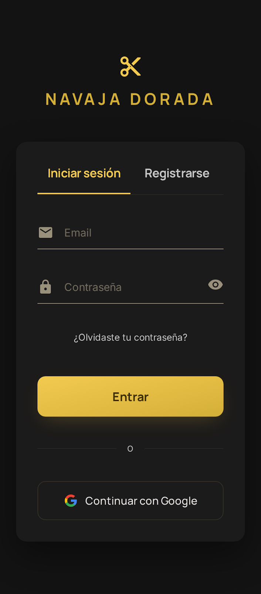
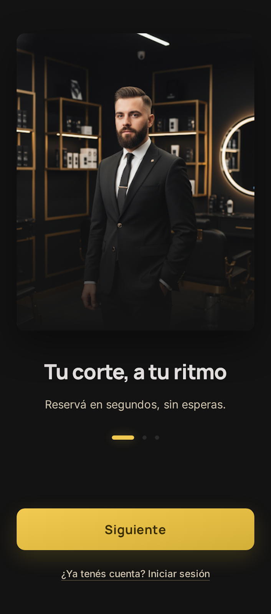
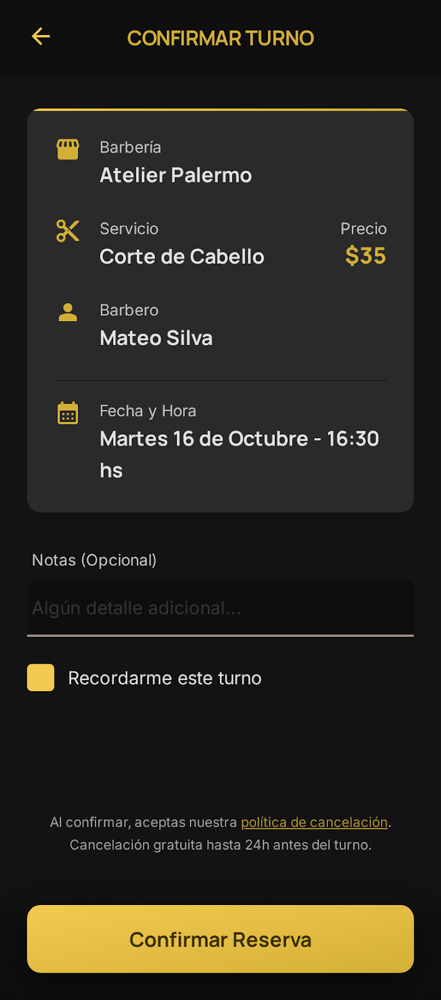
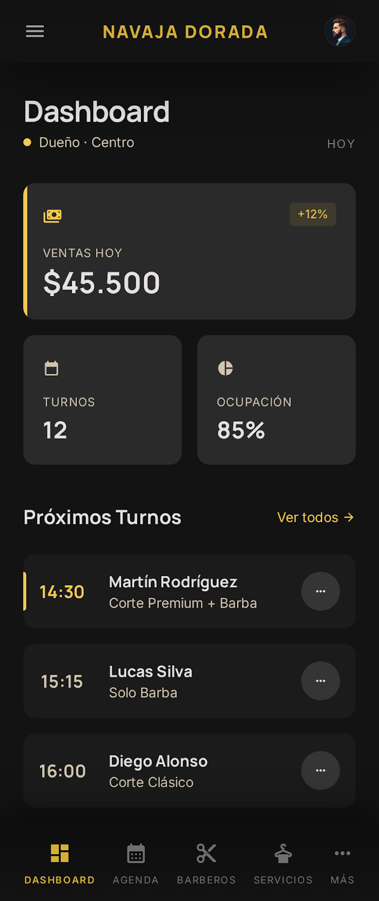

# Navaja Dorada / Barberia

Aplicacion movil para gestion de barberia con experiencia separada por roles, reservas guiadas y paneles de administracion para clientes, barberos y duenos.


## Indice

- [Creado por](#creado-por)
- [Descripcion](#descripcion)
- [Que resuelve](#que-resuelve)
- [Funcionalidades principales](#funcionalidades-principales)
- [Tecnologias](#tecnologias)
- [Estructura del proyecto](#estructura-del-proyecto)
- [Capturas](#capturas)
- [Estado del proyecto](#estado-del-proyecto)
- [Como usar la aplicacion](#como-usar-la-aplicacion)
- [Configuracion de Supabase](#configuracion-de-supabase)
- [Flujo de uso](#flujo-de-uso)
- [Requisitos](#requisitos)
- [Comandos utiles](#comandos-utiles)
- [Variables de entorno](#variables-de-entorno)
- [Notas](#notas)
- [Autor](#autor)
- [Licencia](#licencia)

## Creado por

**Tapia Lautaro**  
Materia: **Diseño de Dispositivos Móviles**

## Descripcion

Este proyecto centraliza la experiencia de reserva y administracion de una barberia. Incluye navegacion por roles, autenticacion, onboarding, reservas paso a paso, historial, perfiles, gestion de servicios y modulos de administracion para el equipo de trabajo.

La app esta pensada para crecer sin romper el flujo actual, usando Supabase como base principal para autenticacion y datos, con persistencia local de respaldo en algunas partes de la aplicacion.

## Que resuelve

- Organiza el proceso de reserva para evitar confusiones.
- Separa la experiencia por rol para mostrar solo lo que corresponde.
- Permite administrar turnos, servicios y clientes desde un flujo centralizado.
- Mantiene respaldo local para no bloquear la experiencia si alguna parte de Supabase no responde.

## Funcionalidades principales

- Inicio de sesion y registro de usuarios.
- Recuperacion de contrasena y verificacion de email.
- Onboarding inicial para guiar al usuario.
- Navegacion separada por roles.
- Reserva de turnos por pasos: barberia, barbero, servicio, horario y confirmacion.
- Historial y seguimiento de turnos.
- Favoritos y perfil de usuario.
- Panel de dueno/barbero con agenda, servicios, clientes y configuracion.
- Integracion con Supabase para autenticacion y datos de la app.
- Componentes reutilizables para toasts, skeletons y UI general.

## Tecnologias

- Expo
- React Native
- Expo Router
- TypeScript
- Supabase
- AsyncStorage

## Estructura del proyecto

- `app/`: pantallas y rutas de la aplicacion.
- `components/`: componentes reutilizables de interfaz.
- `lib/`: logica de negocio, autenticacion y acceso a datos.
- `supabase/`: esquema SQL y guias para la base de datos.
- `diseño/`: referencias visuales y pantallas de diseno.
- `constants/`: constantes del flujo de reservas.

## Pantallas de la app

La aplicacion cuenta con 45 pantallas/rutas distribuidas por modulo:

- Root: 2
- Onboarding: 3
- Auth: 6
- Tabs del cliente: 18
- Panel barberia/dueño: 16

Esta division ayuda a mantener separado el flujo de cliente, autenticacion y administracion interna.

## Configuracion de Supabase

1. Crea un proyecto en Supabase.
2. Copia las credenciales del proyecto en tu archivo `.env`.
3. Usa el archivo `.env.example` como referencia de variables.
4. Ejecuta el script [supabase/manual-sql.sql](supabase/manual-sql.sql) en el SQL Editor de Supabase.
5. Verifica que la autenticacion, las tablas y las politicas RLS queden activas.

## Capturas

### Login



### Onboarding



### Reserva



### Panel del dueno



## Vista previa

| Login                                           | Onboarding                                                                |
| ----------------------------------------------- | ------------------------------------------------------------------------- |
|  |  |

| Reserva                                               | Dashboard                                                     |
| ----------------------------------------------------- | ------------------------------------------------------------- |
|  |  |

## Estado del proyecto

- Base funcional en Expo Router.
- Autenticacion y datos integrados con Supabase.
- Flujo de reservas dividido por pasos.
- Recursos de UI reutilizables para toasts y skeletons.
- Documentacion tecnica y SQL preparada en `supabase/`.
- Migracion progresiva con respaldo local para evitar bloqueos.

## Como usar la aplicacion

### 1. Instalar dependencias

```bash
npm install
```

### 2. Iniciar el proyecto

```bash
npm run start
```

### 3. Abrir en una plataforma

```bash
npm run android
```

```bash
npm run ios
```

```bash
npm run web
```

## Flujo de uso

1. El usuario entra a la app y pasa por el onboarding inicial.
2. Puede crear una cuenta o iniciar sesion.
3. Segun su rol, ve una interfaz distinta.
4. El cliente busca barberia, selecciona barbero, servicio y horario.
5. Confirma la reserva y luego puede revisar su historial.
6. El dueno o barbero administra agenda, servicios, clientes y configuracion desde sus pantallas internas.

## Requisitos

- Node.js instalado.
- Expo CLI o el comando `npm run start`.
- Proyecto configurado con las variables de entorno de Supabase.

## Comandos utiles

```bash
npm run lint
```

```bash
npm run reset-project
```

## Variables de entorno

El proyecto espera las variables de Supabase configuradas en el entorno de desarrollo. Revisa el archivo `.env.example` como referencia.

```bash
EXPO_PUBLIC_SUPABASE_URL=https://tu-proyecto.supabase.co
EXPO_PUBLIC_SUPABASE_ANON_KEY=tu_anon_key
```

## Notas

- La app usa rutas basadas en archivos con Expo Router.
- Algunas vistas usan respaldo local para mantener la app estable durante la migracion.
- El esquema SQL esta preparado para Supabase y se encuentra en [supabase/manual-sql.sql](supabase/manual-sql.sql).
- El material visual de apoyo esta en la carpeta [diseño/](diseño/).

## Autor

**Tapia Lautaro**

## Cierre

Este proyecto fue pensado para mostrar un flujo movil completo, ordenado por roles y listo para seguir creciendo sobre Supabase sin perder estabilidad en la experiencia actual.

## Licencia

Proyecto académico para la materia Diseño de Dispositivos Móviles.
